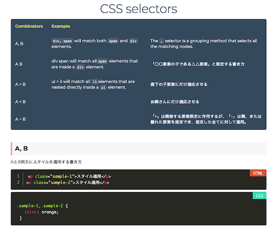
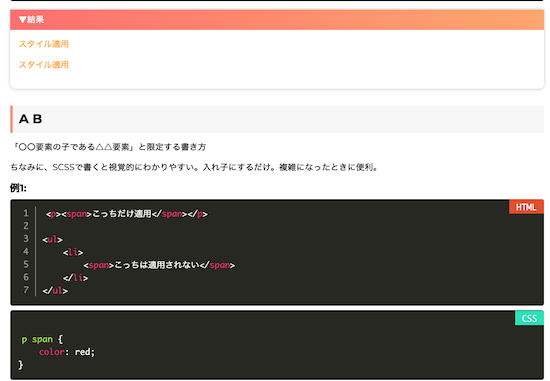
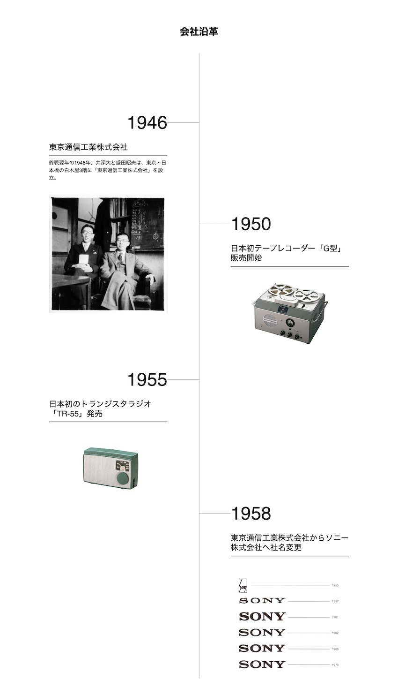

# CSS-Basic

# CSS_selectors

[Prism.jsの使い方](./src/CSS_selectors/selectors_Prism.md)

# sonny

sonnyのホームページの再現

参考元: [Sonyのホームページ](https://www.sony.com/ja/SonyInfo/CorporateInfo/History/company/)

